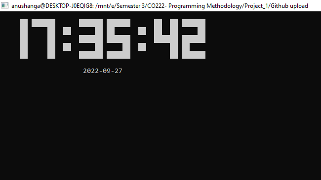
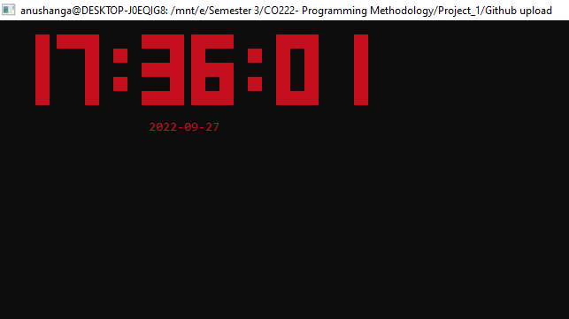
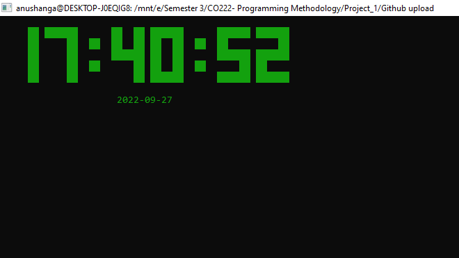
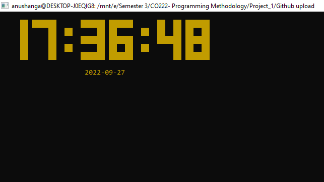
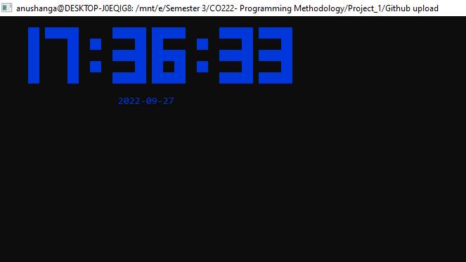
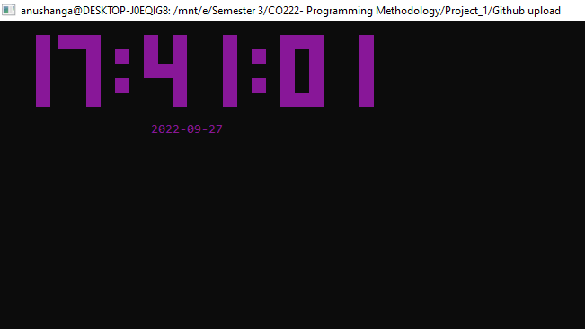
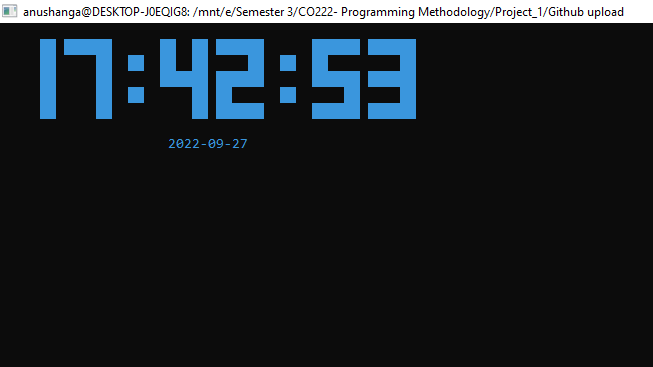

# DigitalClock-in-C

### 1) Compile the program

`gcc -Wall -o ClockProject.c ClockProject`

### 2) Run the binary file

`./ClockProject`

### 3) Run program with colours

`./ClockProject -c red`

### Available colours: 
`red, green, yellow, blue, magenta, cyan, white, black`

